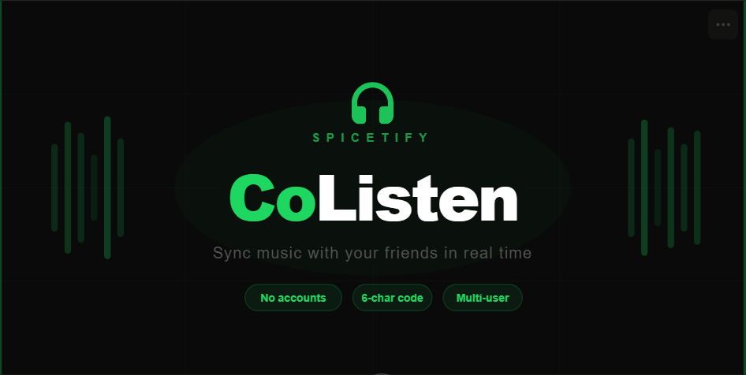

# CoListen

A Spicetify extension that lets you listen to music in sync with your friends in real time. Share a 6-character code, everyone joins instantly. No accounts, no setup.



## Features

- Real-time sync — track changes and play/pause follow the host automatically
- Works over the internet — no need to be on the same network
- Multiple listeners — as many people as you want
- Queue sync — tracks added to the shared queue appear for everyone
- Manual sync button — resync to the host's position whenever you want
- Closing the panel never disconnects you — a mini bar keeps the session alive
- NTP-style clock sync — guests compensate for network delay automatically

---

## How it works

Each user needs to set up their own free Cloudflare Worker that acts as the relay server. This is a one-time setup that takes about 10 minutes and costs nothing.

Once the Worker is deployed, each person pastes their Worker URL into CoListen. After that, hosting and joining sessions works automatically.

---

## Setup guide

### Step 1 — Install Spicetify

If you already have Spicetify installed, skip to Step 2.

**Windows:**
Open PowerShell (search for it in the Start menu) and run this command:

```powershell
iwr -useb https://raw.githubusercontent.com/spicetify/cli/main/install.ps1 | iex
```

Wait for it to finish. Spicetify will install itself and patch Spotify automatically.

**macOS / Linux:**
Open Terminal and run:

```bash
curl -fsSL https://raw.githubusercontent.com/spicetify/cli/main/install.sh | sh
```

---

### Step 2 — Install CoListen

**Option A — Via Marketplace (recommended):**

1. Open Spotify
2. Click the Marketplace icon in the top bar (puzzle piece icon)
3. Search for **CoListen**
4. Click **Install**

**Option B — Manual:**

1. Download `coListen.js` from this repo
2. Copy the file to your Spicetify extensions folder:
   - **Windows:** paste `%appdata%\spicetify\Extensions\` into File Explorer's address bar and press Enter, then drop the file there
   - **macOS / Linux:** copy the file to `~/.config/spicetify/Extensions/`
3. Open a terminal and run:

```bash
spicetify config extensions coListen.js
spicetify apply
```

4. Spotify will restart and the CoListen icon will appear in the top bar

---

### Step 3 — Create a free Cloudflare account

Go to [cloudflare.com](https://cloudflare.com) and create a free account. You don't need to add a domain or enter a credit card — the free plan is enough.

---

### Step 4 — Create the Worker

The Worker is a small server that runs on Cloudflare's network and relays messages between you and your friends. It's free for up to 100,000 requests per day, which is more than enough for personal use.

1. Log in to the [Cloudflare Dashboard](https://dash.cloudflare.com)
2. In the left sidebar, click **Workers & Pages**
3. Click **Create**
4. Click **Create Worker**
5. Give your Worker any name you like (e.g. `colisten-server`)
6. Click **Deploy** — ignore the placeholder code for now, you'll replace it in the next step
7. Click **Edit code** (top right of the Worker page)
8. Delete everything in the editor
9. Paste the full Worker code from below:

<details>
<summary>📋 Click to expand Worker code</summary>

```js
export default {
  async fetch(request, env) {
    const url = new URL(request.url);
    const parts = url.pathname.split("/").filter(Boolean);

    if (parts[0] !== "room" || !parts[1]) {
      return new Response("Not found", { status: 404 });
    }

    const roomId = parts[1];
    const name = url.searchParams.get("name") || "Anonymous";

    const id = env.ROOMS.idFromName(roomId);
    const stub = env.ROOMS.get(id);
    return stub.fetch(request);
  }
};

export class Room {
  constructor(state) {
    this.state = state;
    this.sessions = new Map();
  }

  async fetch(request) {
    if (request.headers.get("Upgrade") !== "websocket") {
      return new Response("Expected WebSocket", { status: 426 });
    }

    const url = new URL(request.url);
    const name = url.searchParams.get("name") || "Anonymous";
    const [client, server] = Object.values(new WebSocketPair());

    server.accept();

    const sessionId = crypto.randomUUID();
    this.sessions.set(sessionId, { ws: server, name });

    this.broadcast({ type: "joined", user: name }, sessionId);
    this.broadcast({
      type: "members",
      members: [...this.sessions.values()].map(s => s.name)
    }, null);

    server.addEventListener("message", evt => {
      try {
        const msg = JSON.parse(evt.data);
        this.broadcast(msg, sessionId);
      } catch {}
    });

    server.addEventListener("close", () => {
      this.sessions.delete(sessionId);
      this.broadcast({ type: "left", user: name }, sessionId);
      this.broadcast({
        type: "members",
        members: [...this.sessions.values()].map(s => s.name)
      }, null);
    });

    return new Response(null, { status: 101, webSocket: client });
  }

  broadcast(msg, excludeId) {
    const data = JSON.stringify(msg);
    for (const [id, session] of this.sessions) {
      if (id !== excludeId) {
        try { session.ws.send(data); } catch {}
      }
    }
  }
}
```

</details>

10. Click **Save and deploy**

---

### Step 5 — Enable Durable Objects

The Worker uses a feature called Durable Objects to keep rooms alive. You need to configure this:

1. Stay on the Worker page and click **Settings** in the top tabs
2. Click **Bindings** in the left menu
3. Click **Add** → **Durable Object namespace**
4. Set the variable name to `ROOMS`
5. Set the class to `Room` (it will appear in the dropdown)
6. Click **Save**

Now click **Deployments** and redeploy the Worker so the binding takes effect. If there's a **Redeploy** button, click it. Otherwise go back to the editor and click **Save and deploy** once more.

---

### Step 6 — Get your Worker URL

1. Go back to your Worker's overview page
2. You'll see a URL that looks like this:

```
https://colisten-server.yourname.workers.dev
```

3. **Change `https://` to `wss://`** — that's what CoListen needs. The final URL should look like:

```
wss://colisten-server.yourname.workers.dev
```

Copy that URL. You'll paste it into CoListen in the next step.

---

### Step 7 — Configure CoListen

1. Open Spotify and click the CoListen icon in the top bar
2. The first time you click **Create session** or **Join session**, a setup screen will appear asking for your Worker URL
3. Paste your `wss://...` URL and click **Save**

That's it. The URL is saved permanently — you won't need to enter it again.

> If you ever need to change the URL (e.g. you redeployed the Worker with a different name), scroll to the bottom of the home screen and click **Change**.

---

## Using CoListen

### Starting a session (host)

1. Click the CoListen icon in the top bar
2. Your Spotify display name is filled in automatically — change it if you want
3. Click **Create session**
4. A 6-character room code appears — share it with your friends (via chat, Discord, etc.)
5. Once someone joins, click **Go to session**
6. Play music normally — everyone follows your player automatically

### Joining a session (guest)

1. Click the CoListen icon in the top bar
2. Enter the 6-character code from the host
3. Click **Join session**
4. Music starts playing and syncing immediately

### During a session

| Action | What happens |
|---|---|
| Host skips a track | Everyone switches to the same track |
| Host plays / pauses | Everyone plays / pauses |
| Host presses ⏮ / ⏭ | Everyone follows |
| Guest clicks ⏮ ⏸ ▶ ⏭ | Command is sent to the host, who executes it for everyone |
| Right-click a song → **Add to CoListen Queue** | Song is added to the shared queue for everyone |
| Click **⟳ Sync now** | Your position resyncs to the host |
| Click **Leave session** | You disconnect, everyone else stays |
| Close the panel | Session stays active — a small bar appears at the bottom |

---

## FAQ

**Do my friends need their own Worker?**
Yes. Each person needs to deploy their own Worker and configure CoListen with their own URL. This takes about 10 minutes and is completely free.

**Can I use the same Worker as a friend?**
Yes, as long as you trust them. Whoever owns the Worker can see room activity in the Cloudflare logs. For privacy it's better to each have your own.

**Is there a limit on how many people can join?**
No hard limit. The free Cloudflare plan supports up to 100,000 WebSocket messages per day, which is plenty for personal use.

**What if the sync is slightly off?**
Click **⟳ Sync now** in the panel. This asks the host for the exact current position and seeks to it.

**Does it work if we're in different countries?**
Yes. Cloudflare runs Workers on servers close to each user, so latency is automatically minimized regardless of where everyone is.

**What if I see "Connection failed"?**
- Double-check that your Worker URL starts with `wss://` not `https://`
- Make sure you completed Step 5 (Durable Objects binding) and redeployed
- Try opening `https://your-worker.workers.dev/room/test` in a browser — if it shows `Expected WebSocket`, the Worker is running correctly

---

## Technical details

- Built with vanilla JavaScript and the Spicetify API
- Real-time relay via Cloudflare Workers (Durable Objects for room state, WebSocket Hibernation for always-on connections)
- NTP-style clock sync: guests run 8 handshake samples on connect and pick the lowest-RTT result to calculate clock offset — typically under 5ms error
- Local position prediction: guests extrapolate the host's position between heartbeats and only seek if drift exceeds 500ms, eliminating audio glitches from constant seeking
- Play/pause propagated immediately via dedicated events, separate from the position heartbeat
- Queue managed via discrete `queue_add` events (not full-state diffs) to prevent duplicates

---

## Author

Made by [@Sermyyy](https://github.com/Sermyyy)

## Donate

[Ko-fi](https://ko-fi.com/sermyyy)

## License

MIT